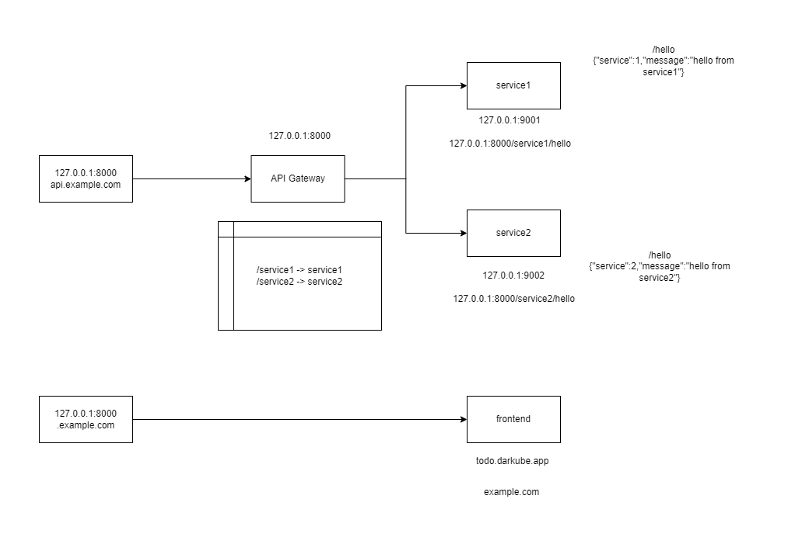

<h1 align="center">FastAPI + Kong ApiGateway Example</h1>

<h3 align="center">A Kong API Gateway setup routing to two FastAPI services</h3>

<p align="center">
  <a href="https://konghq.com/">
    
  </a>
  <a href="https://fastapi.tiangolo.com/">
    
  </a>
  <a href="https://www.docker.com/">
    
  </a>
</p>

<p align="center">
  <strong>Kong API Gateway • FastAPI services • Declarative & DB Mode • Reverse Proxy Routing</strong>
</p>

---

# Guideline

- [Guideline](#guideline)
- [System Overview](#system-overview)
- [Project Structure](#project-structure)
- [How to Run the Project](#how-to-run-the-project)
  - [Non-Declarative (DB Mode) Setup](#non-declarative-db-mode-setup)
    - [1. Start the Stack](#1-start-the-stack)
    - [2. Access Points](#2-access-points)
      - [Kong](#kong)
      - [Direct FastAPI Services (bypassing Kong)](#direct-fastapi-services-bypassing-kong)
    - [3. Configure Kong Using Primate](#3-configure-kong-using-primate)
      - [Step 1 — Install Primate](#step-1--install-primate)
    - [4. Connect Primate to Kong](#4-connect-primate-to-kong)
    - [5. Create a Service in Kong](#5-create-a-service-in-kong)
    - [6. Create a Route for the Service](#6-create-a-route-for-the-service)
  - [Declarative Setup (`kong.yml`)](#declarative-setup-kongyml)
- [FastAPI Services](#fastapi-services)
  - [Services](#services)
- [Declarative `kong.yml`](#declarative-kongyml)
- [Accessing Services Through Kong](#accessing-services-through-kong)
    - [Service 1:](#service-1)
    - [Service 2:](#service-2)
- [License](#license)
- [Bugs](#bugs)

---

# System Overview

This project demonstrates how to run:

* **Two FastAPI microservices**
* A **Kong API Gateway** in front of them
* Both **Declarative** and **Database (Non-Declarative)** Kong setups
* Docker Compose for service orchestration


<p align="center">
    
</p>

Kong acts as the single entrypoint for all clients and proxies traffic to each service.

# Project Structure

```
KongDeclarative/
│── kong.yml
│── docker-compose.yml
│── services/
│     ├── service1/
│     └── service2/

KongNonDeclarative/
│── docker-compose.yml
│── services/
│     ├── service1/
│     └── service2/
```

Use:

* **KongDeclarative** → declarative config
* **KongNonDeclarative** → connect with Primate desktop & configure manually

---


# How to Run the Project

You have **two complete ways** to run Kong:

---


##  Non-Declarative (DB Mode) Setup

This mode uses a **PostgreSQL database** with **Kong migrations**.  
Follow these steps to run and configure Kong with your FastAPI services.

---

###  1. Start the Stack

Run the full environment:

```bash
docker-compose up --build
````

Kong may fail the first time because the **database is not initialized yet**.
If you see migration errors:

1. Wait until PostgreSQL finishes initialization
2. Stop containers
3. Run again:

```bash
docker-compose up
```

This usually resolves the migration race condition.

---

###  2. Access Points

Once running, the endpoints are:

#### Kong

* **Proxy:** `http://localhost:8000`
* **Admin API:** `http://localhost:8001`

#### Direct FastAPI Services (bypassing Kong)

* **Service1:** `http://localhost:9001/hello`
* **Service2:** `http://localhost:9002/hello`

---

###  3. Configure Kong Using Primate

Since this is **Non-Declarative Mode**, you configure Kong manually.

#### Step 1 — Install Primate

Download from:

**[https://github.com/getprimate/primate](https://github.com/getprimate/primate)**

Install and open it.

---

###  4. Connect Primate to Kong

When Primate opens, set the connection to:

```
http://localhost:8001
```

This connects Primate to Kong’s Admin API.

---

###  5. Create a Service in Kong

In Primate:

1. Go to **Services**
2. Click **Create Service**
3. Fill:

   * **Name:** `service1`
   * **URL:** `http://service1:9001`

Save the service.

---

###  6. Create a Route for the Service

In Primate:

1. Open **Routes**
2. Add a new route
3. Set:

   * **Name:** `service1-route`
   * **Paths:** `/service1`
   * **Service:** select `service1`

Save the route.

Now the service is accessible through Kong:

```
http://localhost:8000/service1/hello
```

---


## Declarative Setup (`kong.yml`)

Declarative mode uses **no database**. All routes are defined in `kong.yml`.

Start the declarative environment:

```bash
docker compose -f docker-compose-declarative.yml up --build
```

Kong loads your declarative config file from:

```
/usr/local/kong/declarative/kong.yml
```

This file defines:

* Services
* Routes
* Plugins
* Upstreams

---

# FastAPI Services

Each service exposes a simple endpoint and declares Kong URLs in its `servers` list.

---

## Services

```python
from fastapi import FastAPI
from fastapi.middleware.cors import CORSMiddleware

servers = [
    {"url": "http://127.0.0.1:8000/service1", "description": "Kong Development"},
    {"url": "http://127.0.0.1:9001", "description": "Local Development"},
]

app = FastAPI(
    title="Service 1 API",
    description="Demo FastAPI service behind Kong",
    version="1.0.0",
    servers=servers,
)

app.add_middleware(
    CORSMiddleware,
    allow_origins=["*"],
    allow_credentials=True,
    allow_methods=["*"],
    allow_headers=["*"],
)

@app.get("/hello")
def hello():
    return {"version": "1", "message": "Hello from Service 1!"}
```

---

Service 2 will be an identical structure, only change service name and description.

---


# Declarative `kong.yml`

Your manifest:

```yaml
_format_version: "2.1"

services:
  - name: service1
    host: service1
    port: 8000
    path: /
    routes:
      - name: service1-route
        paths:
          - /service1
        strip_path: true

  - name: service2
    host: service2
    port: 8000
    path: /
    routes:
      - name: service2-route
        paths:
          - /service2
        strip_path: true
```

---

# Accessing Services Through Kong

### Service 1:

```
http://localhost:8000/service1/hello
```

### Service 2:

```
http://localhost:8000/service2/hello
```


# License

MIT.

# Bugs

Open an issue if something isn't working or needs improvement.
